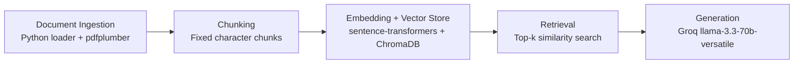

# Project 1 Planning: The Unofficial Guide

> Write this document before you write any pipeline code.
> Your spec and architecture diagram are what you'll use to direct AI tools (Claude, Copilot, etc.) to generate your implementation — the more specific they are, the more useful the generated code will be.
> Update the Retrieval Approach and Chunking Strategy sections if you change your approach during implementation.
> Update this file before starting any stretch features.

---

## Domain

Off-campus housing and dorm-life advice from student discussions, especially Reddit threads in r/college. This knowledge matters because the official housing pages usually explain policies and prices, but they do not tell students what actually works when housing is full, when apartments require credit or income, or when dorm living is worth the cost.

---

## Documents

The corpus mixes housing shortage stories, dorm-vs-apartment comparisons, approval barriers for student renters, and practical room-sharing advice.

| # | Source | Description | URL or location |
|---|--------|-------------|-----------------|
| 1 | r/college thread | Housing shortage, waitlists, emergency plans, and financial aid for rent | https://www.reddit.com/r/college/comments/wlbqbk/my_school_has_no_where_for_me_to_live_on_campus/ |
| 2 | r/college thread | Whether dorm life is worth the cost | https://www.reddit.com/r/college/comments/sx5l1a/is_dorm_life_worth_it/ |
| 3 | r/college thread | Student apartment approval problems, credit score, and income requirements | https://www.reddit.com/r/college/comments/13vi9xb/college_student_apartments/ |
| 4 | r/college thread | Student housing cost comparisons and whether it is overpriced | https://www.reddit.com/r/college/comments/leiasr/is_student_housing_a_scam/ |
| 5 | r/college thread | General dorm-life tradeoffs and first-year housing rules | https://www.reddit.com/r/college/comments/qamuez/what_is_it_like_living_in_a_college_dorm/ |
| 6 | r/college thread | Choosing the best floor in a dorm and avoiding noise | https://www.reddit.com/r/college/comments/11v4fqi/in_your_opinion_what_is_the_best_and_worst_floor/ |
| 7 | r/college thread | Sharing a dorm, boundaries, and what to bring | https://www.reddit.com/r/college/comments/14hz54g/sharing_a_dorm_im_nervous_and_have_some_questions/ |
| 8 | r/college thread | Dorm vs apartment decision for a transfer student | https://www.reddit.com/r/college/comments/tq0u2n/dorm_vs_apartment/ |
| 9 | r/college thread | Whether freshmen should live off campus | https://www.reddit.com/r/college/comments/14l0ebv/should_i_stay_off_campus_as_a_freshman_hear_me_out/ |
| 10 | r/college thread | Freshman off-campus apartment tradeoffs and roommate matching | https://www.reddit.com/r/college/comments/1bqft01/is_it_a_bad_idea_to_live_off_campus_in_an_apartment_as_a_freshman/ |

---

## Chunking Strategy

<!-- How will you split documents into chunks?
     State your chunk size (in tokens or characters), overlap size, and explain why those
     numbers fit the structure of your documents.
     A review-heavy corpus warrants different chunking than a long FAQ. -->

**Chunk size:** 1000 characters

**Overlap:** 150 characters

**Reasoning:** These sources are short Reddit-thread excerpts and comment summaries, so slightly smaller character chunks preserve individual advice points without splitting one comment across unrelated advice. The overlap helps when a useful recommendation begins at the end of one section and continues in the next, but the chunks are still large enough to keep the surrounding context for nuanced housing advice.

---

## Retrieval Approach

<!-- Which embedding model are you using (e.g., all-MiniLM-L6-v2 via sentence-transformers)?
     How many chunks will you retrieve per query (top-k)?
     If you were deploying this for real users and cost wasn't a constraint, what tradeoffs
     would you weigh in choosing a different embedding model — context length, multilingual
     support, accuracy on domain-specific text, latency? -->

**Embedding model:** all-MiniLM-L6-v2 via sentence-transformers

**Top-k:** 4

**Production tradeoff reflection:** If cost were not a constraint, I would compare larger embedding models with better semantic nuance and longer context windows against the local MiniLM baseline. For this corpus, I care most about retrieving the right student anecdote even when the query wording is different; a stronger model might improve that, but it would trade off latency, size, and simplicity. I would also weigh multilingual support and better handling of domain-specific terms like housing aid, co-signers, and roommate matching.

---

## Evaluation Plan

<!-- List your 5 test questions with their expected correct answers.
     Questions should be specific enough that you can judge whether the system's response
     is right or wrong. "What are good dining halls?" is too vague.
     "What do students say about wait times at [dining hall name] during lunch?" is testable. -->

| # | Question | Expected answer |
|---|----------|-----------------|
| 1 | What do students say to do if on-campus housing is full? | Look for off-campus housing, ask about emergency housing or temporary placements, and use leftover financial aid or loans for rent if allowed. |
| 2 | Is dorm life always cheaper than living off campus? | No. Students say it depends on the school; off-campus can be cheaper, but utilities, transportation, and furnishings can change the total cost. |
| 3 | What problems do students run into when trying to rent an apartment off campus? | Lack of credit history, rental history, and income can make approval difficult. |
| 4 | What makes freshmen consider living off campus anyway? | Lower cost, more comfort, roommate matching, and the ability to choose a better housing setup. |
| 5 | What advice do students give about choosing a dorm room or floor? | Pick based on noise, privacy, and convenience rather than assuming there is one universally best floor. |

---

## Anticipated Challenges

<!-- What could go wrong? Name at least two specific risks with reasoning.
     Consider: noisy or inconsistent documents, missing source attribution, off-topic
     retrieval, chunks that split key information across boundaries. -->

1. The corpus is opinion-heavy and sometimes contradictory. Different students make opposite claims about whether dorms or apartments are cheaper, so retrieval needs enough context to surface the right nuance instead of treating every statement as a fact.

2. Several sources are short excerpts rather than long structured articles. That increases the risk of under-retrieval if chunks are too small or over-retrieval if the system pulls too many loosely related snippets.

---

## Architecture

<!-- Draw a diagram of your pipeline showing the five stages:
     Document Ingestion → Chunking → Embedding + Vector Store → Retrieval → Generation
     Label each stage with the tool or library you're using.
     You can use ASCII art, a Mermaid diagram, or embed a sketch as an image.
     You'll use this diagram as context when prompting AI tools to implement each stage. -->

---

## AI Tool Plan

<!-- For each part of the pipeline below, describe:
     - Which AI tool you plan to use (Claude, Copilot, ChatGPT, etc.)
     - What you'll give it as input (which sections of this planning.md, which requirements)
     - What you expect it to produce
     - How you'll verify the output matches your spec

     "I'll use AI to help me code" is not a plan.
     "I'll give Claude my Chunking Strategy section and ask it to implement chunk_text()
     with my specified chunk size and overlap" is a plan. -->

**Milestone 3 — Ingestion and chunking:** I will give Copilot the Domain, Documents, and Chunking Strategy sections from this file plus the ingestion requirements from the assignment. I expect it to produce a loader that reads local files, cleans noisy text, and chunks the corpus without splitting advice into unusable fragments. I will verify it by printing cleaned documents and sample chunks.

**Milestone 4 — Embedding and retrieval:** I will give Copilot the Retrieval Approach section, the architecture diagram, and the document metadata format. I expect it to build the ChromaDB persistence and semantic search layer with source metadata attached. I will verify it by querying a few evaluation questions and checking the returned chunks and distance scores.

**Milestone 5 — Generation and interface:** I will give Copilot the grounding requirement, the retrieval output format, and the UI requirement. I expect it to wire the retrieved chunks into Groq, enforce grounded answers, and surface the sources in the interface. I will verify it by asking both answerable and unanswerable questions and checking that the model cites only the retrieved documents.
